# CODEX COMPANY Skill Map

2026-03-31 기준으로 `~/.codex/skills` 실설치 상태와 `data/skill_registry.json` 스냅샷을 대조한 결과다.

## Audit Summary

- 실설치 스킬 수: `20`
- 기존 레지스트리 스냅샷 수: `18`
- 기존 스냅샷 누락: `imagegen`, `plugin-creator`
- 기존 스냅샷 오염: `"openai-docs"`처럼 이름에 불필요한 따옴표가 들어간 항목
- 조치: `scripts/sync_skill_registry.py` 파서 보정, 시스템 스킬 분류 보강, 레지스트리 재생성

## CODEX COMPANY 부서 구조

- `Owner`: 사용자. 최종 의사결정과 우선순위 조정 담당.
- `Root Operator`: Codex. 실제 실행 주체이자 부서 간 라우터.
- `Executive Office`: 전체 워크플로 통제와 툴 전략 담당.
- `Core Delivery HQ`: 기획, 설계, 구현, QA, 아이디어 생성의 핵심 실행 라인.
- `Creative Studio`: 디자인, 페르소나, 에세이, 블로그 톤과 표현 담당.
- `Intelligence & Growth`: 비즈니스, 데이터, 프롬프트 개인화 담당.
- `Care Desk`: 감정 점검과 위험 신호 대응 담당.
- `Platform Services`: 문서 조회, 이미지 생성, 플러그인/스킬 생성과 설치 담당.

## Department Roster

- `Executive Office`
  - `multi-agent-manager-ko`: Operations Control
  - `llm-tool-advisor-ko`: Tool Strategy
- `Core Delivery HQ`
  - `planner-agent-ko`: Planning
  - `architect-agent-ko`: Architecture
  - `implementer-agent-ko`: Implementation
  - `qa-agent-ko`: Quality Assurance
  - `idea-agent-ko`: Innovation
- `Creative Studio`
  - `design-trend-agent-ko`: Design
  - `entp-clone-ko`: Persona
  - `personal-essay-writer-ko`: Writing
  - `portfolio-blog-writer-ko`: Publishing
- `Intelligence & Growth`
  - `startup-business-strategist-ko`: Business Strategy
  - `sql-data-insight-ko`: Data Intelligence
  - `prompt-personalization-ko`: Prompt Personalization
- `Care Desk`
  - `mortality-resident-ko`: Mental Check-in
- `Platform Services`
  - `openai-docs`: Docs Access
  - `imagegen`: Image Generation
  - `plugin-creator`: Plugin Scaffolding
  - `skill-creator`: Skill Authoring
  - `skill-installer`: Skill Installation

## ASCII Tree

```text
CODEX COMPANY
├── Owner: User
├── Root Operator: Codex
└── Departments
    ├── Executive Office
    │   ├── llm-tool-advisor-ko [Tool Strategy]
    │   └── multi-agent-manager-ko [Operations Control]
    ├── Core Delivery HQ
    │   ├── architect-agent-ko [Architecture]
    │   ├── idea-agent-ko [Innovation]
    │   ├── implementer-agent-ko [Implementation]
    │   ├── planner-agent-ko [Planning]
    │   └── qa-agent-ko [Quality Assurance]
    ├── Creative Studio
    │   ├── design-trend-agent-ko [Design]
    │   ├── entp-clone-ko [Persona]
    │   ├── personal-essay-writer-ko [Writing]
    │   └── portfolio-blog-writer-ko [Publishing]
    ├── Intelligence & Growth
    │   ├── prompt-personalization-ko [Prompt Personalization]
    │   ├── sql-data-insight-ko [Data Intelligence]
    │   └── startup-business-strategist-ko [Business Strategy]
    ├── Care Desk
    │   └── mortality-resident-ko [Mental Check-in]
    └── Platform Services
        ├── imagegen [Image Generation]
        ├── openai-docs [Docs Access]
        ├── plugin-creator [Plugin Scaffolding]
        ├── skill-creator [Skill Authoring]
        └── skill-installer [Skill Installation]
```

## Mermaid

```mermaid
graph TD
    USER["Owner: User"] --> CODEX["Root Operator: Codex"]
    CODEX --> DEPTS["CODEX COMPANY Departments"]
    DEPTS --> D1["Executive Office"]
    D1 --> D1S1["llm-tool-advisor-ko<br/>Tool Strategy"]
    D1 --> D1S2["multi-agent-manager-ko<br/>Operations Control"]
    DEPTS --> D2["Core Delivery HQ"]
    D2 --> D2S1["architect-agent-ko<br/>Architecture"]
    D2 --> D2S2["idea-agent-ko<br/>Innovation"]
    D2 --> D2S3["implementer-agent-ko<br/>Implementation"]
    D2 --> D2S4["planner-agent-ko<br/>Planning"]
    D2 --> D2S5["qa-agent-ko<br/>Quality Assurance"]
    DEPTS --> D3["Creative Studio"]
    D3 --> D3S1["design-trend-agent-ko<br/>Design"]
    D3 --> D3S2["entp-clone-ko<br/>Persona"]
    D3 --> D3S3["personal-essay-writer-ko<br/>Writing"]
    D3 --> D3S4["portfolio-blog-writer-ko<br/>Publishing"]
    DEPTS --> D4["Intelligence & Growth"]
    D4 --> D4S1["prompt-personalization-ko<br/>Prompt Personalization"]
    D4 --> D4S2["sql-data-insight-ko<br/>Data Intelligence"]
    D4 --> D4S3["startup-business-strategist-ko<br/>Business Strategy"]
    DEPTS --> D5["Care Desk"]
    D5 --> D5S1["mortality-resident-ko<br/>Mental Check-in"]
    DEPTS --> D6["Platform Services"]
    D6 --> D6S1["imagegen<br/>Image Generation"]
    D6 --> D6S2["openai-docs<br/>Docs Access"]
    D6 --> D6S3["plugin-creator<br/>Plugin Scaffolding"]
    D6 --> D6S4["skill-creator<br/>Skill Authoring"]
    D6 --> D6S5["skill-installer<br/>Skill Installation"]
```



## Commands

```bash
python3 scripts/list_skills.py
python3 scripts/sync_skill_registry.py
```
